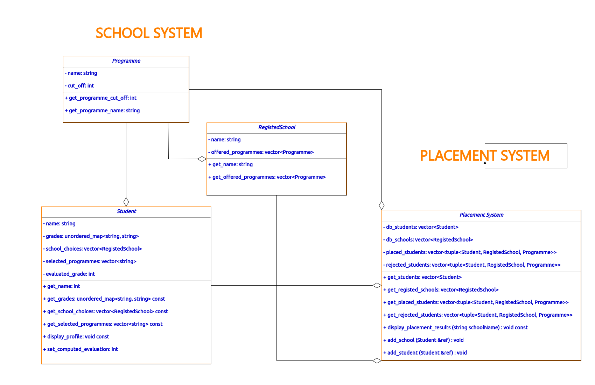

# Placement System for Semester Project Demonstration

## Usage

### Prerequisites

You will need:

* A modern C/C++ compiler
* CMake 3.1+ installed (on a Mac, run `brew install cmake`)
* If you prefer to code in a great IDE, I highly recommend [Jetbrains CLion](https://www.jetbrains.com/clion/) or VSCode with `clangd` extension installed. It is fully compatible with this project.

### Building The Project

#### Cloning

```bash
❯ cd ~/workspace
❯ git clone https://github.com/blackprince001/SchoolPlacementSystem
❯ cd SchoolPlacementSystem/build
```

After the above, Run the command `cmake ..` to start building the project.
<pre>
<font color="#859900"><b>➜</b></font> <font color="#586E75">cmake</font> <u style="text-decoration-style:single">..</u>
-- Configuring done
-- Generating done
-- Build files have been written to: .../SchoolPlacementSystem/build
</pre>

All binary after the building and compilation should be found in `SchoolPlacementSystem/build` as expected.

#### Project UML Implementation



#### Project Structure

```bash
.
├── assets
│   ├── defaults.py
│   └── generate_students.py
├── CMakeLists.txt
├── main.cpp
├── PlacementSystem
│   ├── placement_system.cpp
│   └── placement_system.hpp
├── README.md
├── SchoolSystem
│   ├── SchoolSystem.cpp
│   └── SchoolSystem.hpp
├── students.txt
├── UML-diagram-for-system.png
└── utils
    └── utils.cpp

4 directories, 12 files

```

